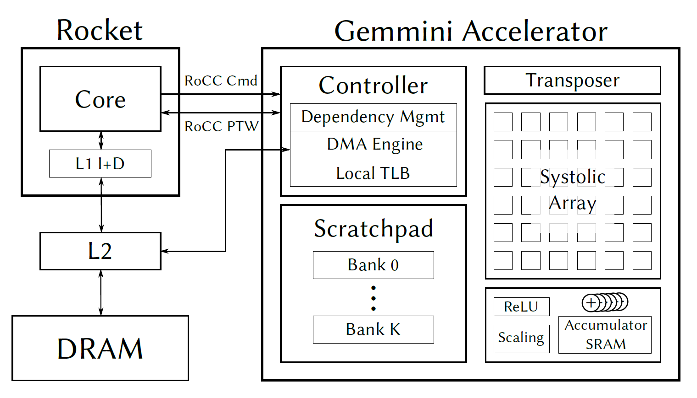
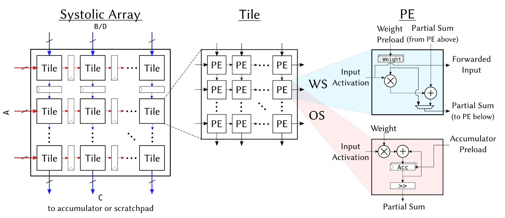
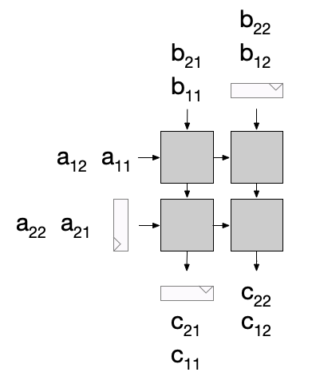
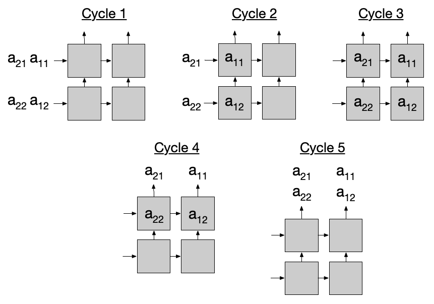
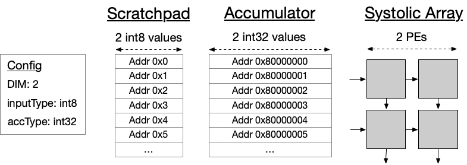
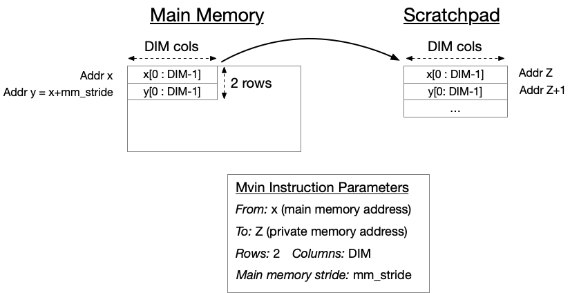
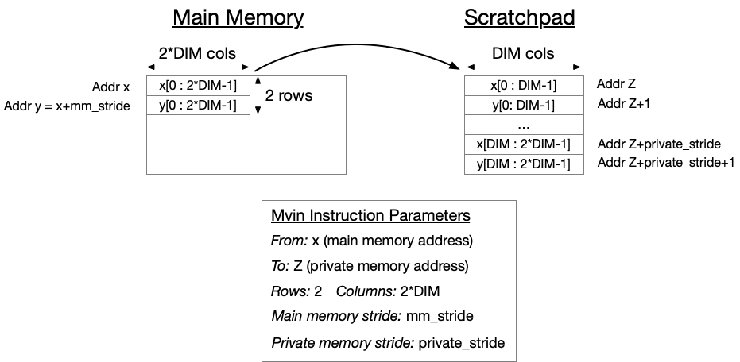

# Gemmini — what it is and how it is built

The hardware, in one pass: what Gemmini is, what is inside it, how data moves
through it, and which elaboration-time parameters shape it. Figures are the
upstream README's, with the explanations expanded and checked against the RTL.

This is document 1 of 3. [`Gemmini_ISA_tutorial.md`](Gemmini_ISA_tutorial.md)
teaches you to program it; [`Gemmini_ISA_reference.md`](Gemmini_ISA_reference.md)
is the instruction-by-instruction reference. Build and run instructions are
[`../Gemmini_Build_Test.md`](../Gemmini_Build_Test.md).

**Provenance.** `generators/gemmini/README.md` (Architecture, Generator
Parameters, Major Components, Memory Addressing, ISA), checked against the
in-tree RTL at `generators/gemmini/src/main/scala/gemmini/`. Default-config
values from `Configs.scala`, `defaultConfig`. Figures copied from
`generators/gemmini/img/` at submodule commit `8c3f9923`.

> **The README has drifted from this tree.** It still describes an `ROB` and an
> `rob_entries` parameter; this tree has `ReservationStation.scala` and three
> separate `reservation_station_entries_*` parameters. Its type list is also
> short by three. §7 gives the real names. Read `GemminiConfigs.scala` at your
> pinned commit before trusting any parameter name below.

---

## 1. What Gemmini is

Gemmini is a **RoCC accelerator**: a matrix-multiply engine bolted to the side
of a Rocket or BOOM tile, reached through custom RISC-V instructions rather than
through MMIO or a driver. It is not a RISC-V extension, and the RoCC interface
it hangs off is a Berkeley convention that no RISC-V standard describes — the
consequences of that are the whole subject of the reference document.

It is also not only an accelerator. Upstream describes it as a *full-system,
full-stack DNN hardware exploration platform*: the point is to let you change
the array, the memory system, the dataflow and the software stack together and
measure what happens. That is why so much of it is parameterized (§7) and why
the same ISA has both primitive instructions and CISC loop instructions (§6).



Read the figure outside-in. The host CPU and Gemmini sit in the same tile and
share the memory system. Commands enter from the CPU over the RoCC port. Inside,
three things define the accelerator:

- **A systolic array** at the centre, computing `C = A · B + D` on `DIM × DIM`
  tiles (§2).
- **Private scratchpad and accumulator SRAMs**, explicitly managed (§4). Nothing
  is cached, nothing is coherent, nothing is implicit. You move data in, compute,
  move it out.
- **Decoupled access/execute** (§3): loads, stores and computation run
  concurrently in three independent controllers, reordered against each other by
  a reservation station.

By default it reaches memory through the System Bus, straight to L2, and not
through the host's L1 D$.

```
            ┌─────────────────────────── Rocket / BOOM tile ───────────┐
            │                                                          │
            │   core ──RoCC cmd──► Gemmini                             │
            │                        │                                 │
            │        ┌───────────────┼───────────────┐                 │
            │        ▼               ▼               ▼                 │
            │   LoadCtrl        ExecuteCtrl      StoreCtrl             │
            │        │               │               │                 │
            │        │          MeshWithDelays       │                 │
            │        │         (Mesh + Transposer)   │                 │
            │        │               │               │                 │
            │        └──────► scratchpad / accumulator ◄────┘          │
            │                        │                                 │
            │                    DMA + TLB                             │
            └────────────────────────┼─────────────────────────────────┘
                                     ▼
                              System Bus → L2 → DRAM
```

---

## 2. The systolic array

### 2.1 Two tiers: Mesh, Tile, PE

`Mesh.scala` implements the array as a **two-level hierarchy**:

| Level | Module | Composition |
|---|---|---|
| Mesh | `Mesh.scala` | a grid of Tiles, **pipeline registers between tiles** |
| Tile | `Tile.scala` | a **combinational** set of PEs |
| PE | `PE.scala` | one multiply-accumulate, WS or OS |



The split exists to trade area against timing. Inside a tile everything is
combinational — fast, but the critical path grows with tile size. Between tiles
there are registers — pipelined, but each register costs area and adds a cycle
of latency to the array's fill and drain. `tileRows`/`tileColumns` set how much
logic is combinational; `meshRows`/`meshColumns` set how many such blocks are
pipelined together.

The default config is `tileRows = tileColumns = 1` and
`meshRows = meshColumns = 16`: every PE separated by a register, a 16×16 array.
That is the conservative corner — shortest critical path, most registers.

`DIM` throughout the software is `meshRows × tileRows` = 16 in the default
config, and it is the **only** matmul size the array knows. Everything larger is
tiled, either by you or by the loop unrollers of §6. `MeshWithDelays` assumes
every matmul is exactly `DIM × DIM`; its counters count to `DIM` and then latch
the next operation's configuration.

### 2.2 Why the inputs must be skewed

A systolic array works because operands *meet* at a PE on exactly the right
cycle. Element `A[i][k]` has to arrive at the same PE on the same cycle as
`B[k][j]`, and they start from different edges of the array and travel different
distances. So the inputs are staggered through **shift registers** before they
enter, and the outputs are de-staggered on the way out.



The figure shows a 2×2 output-stationary matmul with `D` ignored, and the delay
registers at the inputs and outputs. Rows enter one per cycle, each successive
row delayed one more cycle than the last, so the diagonal wavefront of data
sweeps across the array. This is the hardware equivalent of the skew you would
draw by hand in a systolic-array diagram.

The pipelining this buys is deeper than it looks. `MeshWithDelays` tags each
matmul with an id, and a result emerges **two matmuls later in WS and three in
OS** (`matmul_id_of_output` in `MeshWithDelays.scala`). Several matmuls are
therefore in flight at once — `max_simultaneous_matmuls` defaults to
`5 × latency_per_pe`, which is 5 for the default `tile_latency = 0` and
`tileRows = tileColumns = 1`. The array is not idle between your `compute`
instructions; it is draining earlier ones.

All of this lives in `MeshWithDelays.scala`, which wraps the bare `Mesh` and
adds what it cannot supply itself:

- the delay registers above,
- the transposer (§2.3),
- counters and configuration registers that latch per-matmul settings: which of
  `A`/`B` to transpose, and whether the preloaded values survive into the next
  matmul.

It takes `A`, `B` and `D` one row per cycle and emits `C = A · B + D` one row
per cycle.

### 2.3 The transposer



The transposer is itself a very simple systolic array: it transports inputs
**left-to-right for `DIM` cycles**, then **bottom-to-top for another `DIM`
cycles**. Data goes in along one axis and comes out along the other.

The part that surprises people: **in output-stationary mode the transposer is
used on every matmul, even when you did not ask for a transposition.** The
reason is a layout mismatch, not a mathematical one.

In OS mode the array wants all elements of one row of `A` to enter the *same*
PE, one after another. But a scratchpad row stores those elements side by side,
so reading a row out naturally feeds them to *adjacent* PEs — which is what WS
mode wants and OS mode does not. The transposer converts one arrangement into
the other. It is a plumbing fix for how the SRAM is laid out.

### 2.4 The two dataflows

| | Preloaded into the array | Streamed through |
|---|---|---|
| **Weight-stationary (WS)** | `B` (the weights) | `A` and `D` |
| **Output-stationary (OS)** | `D` (the partial sums) | `A` and `B` |

`dataflow` picks one at elaboration, or `Dataflow.BOTH` to leave the choice to
runtime via `config_ex`. The default is `BOTH`.

Types differ across the array boundary. `A`, `B` and `D` are `inputType`; `C` is
`spatialArrayOutputType`. Writing `C` to the scratchpad casts it **down** to
`inputType`; writing it to the accumulator casts it **up** to `accType`.

A consequence worth internalizing, because it shapes how every WS program is
written: **in WS mode an `inputType` `D` is usually too narrow to hold a partial
sum.** So `D` is normally just the zero matrix on the `compute` path, and the
`accType` accumulator SRAMs carry the partial sums instead. That is why the
tutorial's tile moves `D` into the *accumulator* with `mvin3` and passes
`GARBAGE_ADDR` to `compute` — the bias enters through the accumulator, not
through the array.

Each matmul is issued as a **pair** of instructions, `preload` then `compute`,
because one instruction cannot carry four addresses. `compute.preloaded` uses
what was just staged; `compute.accumulated` reuses what is already resident — in
OS that means accumulating onto the `C` in the array, in WS it means reusing the
same weights for another `A`. See [reference §10](Gemmini_ISA_reference.md).

---

## 3. Decoupled access/execute

Gemmini is a **decoupled access/execute** design: memory-access and execute
instructions proceed concurrently, in different regions of the hardware. Three
controllers consume ISA commands independently and share the SRAMs:

| Controller | File | Owns |
|---|---|---|
| `ExecuteController` | `ExecuteController.scala` | matmuls; holds `MeshWithDelays` and the transposer |
| `LoadController` | `LoadController.scala` | DRAM → scratchpad/accumulator |
| `StoreController` | `StoreController.scala` | scratchpad/accumulator → DRAM, **and max-pooling** |

Pooling lives in the store path because Gemmini pools on the way out, as data
leaves the private SRAMs — so the `DMAWriter` carries a set of `>` comparators
for it.

Each controller decodes and executes its own commands. The ordering rules are
asymmetric, and both halves matter:

- Instructions in **different** controllers run concurrently and **out of order**
  with respect to each other.
- Instructions in the **same** controller are issued strictly **in order**, and
  each controller handles its own internal hazards on that assumption.

Cross-controller hazards are therefore somebody else's job — **`ReservationStation.scala`**,
what the README still calls the ROB. An instruction is released to its
controller only once it has no outstanding dependency on an instruction in
another controller. It does *not* check hazards within a controller, by design.

This is the structural reason Gemmini needs no fence of its own and why the
host's `fence` works: the core stalls on Gemmini's `busy` signal, which is the
OR of the reservation station, the scratchpad, the loop unrollers and pending
commands.

### The DMA

Two engines in `DMA.scala`, one per direction, both operating on **virtual
addresses** and sharing a TLB (`FrontendTLB.scala`). On a TLB miss it falls
transparently back to a page-table walker **shared with the host CPU**. This is
why you hand Gemmini plain `malloc`'d pointers, and why the same instruction
stream runs bare-metal and under Linux.

Once physical addresses are in hand, the DMAs break large requests into TileLink
reads and writes. TileLink requires each request to be aligned to the number of
bytes requested and that size to be a power of two. Within that constraint the
engines deliberately **over-read** when it lets them issue fewer requests —
empirically, request count limits throughput more than a little wasted bandwidth
does.

---

## 4. Scratchpad and accumulator

Both live in `Scratchpad.scala`; banks are `ScratchpadBank` and
`AccumulatorMem.scala`. Each row of either is `DIM` **elements** wide.

| | Element type | Default | Row width (default) | Extras |
|---|---|---|---|---|
| Scratchpad | `inputType` | `SInt(8.W)` | 16 × 8 = **128 bits** | little more than SRAM + queue |
| Accumulator | `accType` | `SInt(32.W)` | 16 × 32 = **512 bits** | adders, scalers, activation units |

The asymmetry is the point. The scratchpad is dumb storage for operands. The
accumulator is where the quantization pipeline lives:

- **Adders** for in-place accumulation, which is what makes `K`-dimension tiling
  work without a round trip to DRAM.
- **Scalers.** Reading `accType` out as `inputType` applies a scaling function —
  by default a multiply by a `float32` that casts `int32` down to `int8`. The
  function is configurable at elaboration (`acc_scale_args`).
- **Activation units** — ReLU and friends, applied on the way out.

Scratchpad inputs and outputs are always `inputType`. Accumulator inputs and
outputs may be either: `inputType` in is cast **up** to `accType`, `inputType`
out is scaled **down** from it. That down-conversion — scale, then activate — is
exactly the step that turns one layer's partial sums into the next layer's
quantized inputs, which is why it is in hardware at all.

Conceptually the accumulator is an extension of the scratchpad address space:
the array can write results to any accumulator address and read operands from
any accumulator address, and the DMA can move data directly between the
accumulator and DRAM, which is how biases get loaded.

### 4.1 Row addressing

Gemmini's private memory is **row-addressed**. One address names one row of
`DIM` elements — not one element. A 16 × 16 tile therefore occupies 16
consecutive addresses.



The figure shows the scheme for a 2×2 array. Every private address is 32 bits,
and the **three most significant bits are reserved**:

| Bit | When it applies | Meaning |
|---|---|---|
| 31 | always | `0` = scratchpad, `1` = accumulator |
| 30 | accumulator **write** | `0` = overwrite, `1` = accumulate onto what is there |
| 29 | accumulator **read** | `0` = scaled-down `inputType`, `1` = raw `accType` |
| 28:0 | always | row address |

Bit 30 is ignored for the scratchpad and for accumulator reads; bit 29 is
ignored for the scratchpad and for accumulator writes. Reading with bit 29 set
bypasses **both** the activation function and the scaling — the raw partial-sum
path.

Two consequences that catch people out:

- **The accumulate-versus-overwrite choice is in the address, not the opcode.**
  There is no separate "accumulating store" instruction; you set bit 30 in the
  address you hand to `preload` or `mvin`.
- Because these bits live in the *address*, they travel inside a 64-bit operand
  register, not in the instruction word. The instruction word has no room for
  them — see [reference §7](Gemmini_ISA_reference.md) for the full operand
  layout and the normative bit tables.

---

## 5. Moving data in and out

The DMA's job, from the programmer's side, is `mvin` and `mvout`. The
normative encodings are [reference §9](Gemmini_ISA_reference.md); what follows is
the shape of the operation, which is what the figures show.

`mvin` takes a virtual DRAM address and a local address, plus an explicit
`rows × cols` count. It loads a 2D submatrix sequentially from both base
addresses. The **main-memory stride** is not in the instruction — it comes from
a `config_mvin` issued earlier.



`rows` must be ≤ `DIM`. `cols` need not be:



When `cols > DIM`, one `mvin` becomes a **block move** of several submatrices.
The private-memory stride *between* those submatrices is `block_mvin_stride`,
also set by `config_mvin`. This is how you load a wide operand in one
instruction instead of several.

There are **three** `mvin` instructions — `mvin`, `mvin2`, `mvin3` — and they
are functionally identical. What differs is that each has its **own independent
set of configuration registers**. That exists for one reason: in a `C = A·B + D`
matmul, `A`, `B` and `D` may live in DRAM with three different strides and want
three different scales. With three ports you configure each once, outside the
loop, and then issue moves freely. With one port you would reconfigure before
every move.

In the default `int8`/`int32` config this is not a nicety: `A` and `B` have a
16-byte DRAM row stride while `D`, being `int32`, has 64. Forgetting the `id`
argument to `config_mvin` — and so configuring the wrong port — is a standing
trap ([reference §23, item 9](Gemmini_ISA_reference.md)).

`mvout` is the reverse, and requantizes on the way out unless you ask for the
raw `accType` path with bit 29.

---

## 6. Loop unrollers

The array only does `DIM × DIM`. Tiling anything bigger by hand in C costs loop
overhead, and unrolling and pipelining those loops well is hard. So Gemmini
provides CISC-type instructions that tile and unroll **in hardware**:
`LoopMatmul.scala` and `LoopConv.scala`.

They are FSMs, and they do two things software finds awkward:

- **Double-buffer** tiles, so the next load overlaps the current matmul.
- **Watch the reservation station's occupancy** and throttle themselves. If the
  station fills with matmul instructions leaving no room for loads, the FSM
  pauses issuing matmuls so loads can get in. A software loop cannot see that
  state at all.

They add no expressive power — anything they do can be written by hand with
`mvin`/`preload`/`compute`/`mvout`. They exist because they schedule better than
most hand-written tiling, and because they eliminate the per-instruction operand
packing the host would otherwise pay for. The tutorial quantifies that packing
cost; it is the dominant host-side expense in a hand-tiled loop.

---

## 7. Generator parameters

From `GemminiArrayConfig` in `GemminiConfigs.scala`. Default-config values from
`Configs.scala`.

### Array geometry

| Parameter | Default | Meaning |
|---|---|---|
| `tileRows`, `tileColumns` | 1, 1 | PEs per combinational tile |
| `meshRows`, `meshColumns` | 16, 16 | tiles per pipelined mesh |
| `dataflow` | `Dataflow.BOTH` | `OS`, `WS`, or both selectable at runtime |

### Types

The README lists three. This tree has **six**:

| Parameter | Default | Meaning |
|---|---|---|
| `inputType` | `SInt(8.W)` | scratchpad element |
| `weightType` | `SInt(8.W)` | weight element |
| `accType` | `SInt(32.W)` | accumulator element, partial sums |
| `spatialArrayInputType` | `SInt(8.W)` | what enters the array |
| `spatialArrayWeightType` | `SInt(8.W)` | weights inside the array |
| `spatialArrayOutputType` | `SInt(20.W)` | **PE-to-PE** width, not the result width |

`spatialArrayOutputType` is the one that surprises people: it is the width of
the value passed *between* PEs, not of anything you can observe from software.
An 8×8 multiply needs more than 8 bits to hand on, and the default gives it 20.
The README calls this `outputType` and suggests 16.

Any of these may be floating-point — `Float(8, 24)` for IEEE single. If you do
that, also raise `pe_latency`, the number of shift registers inside each PE, if
a multiply-accumulate cannot close in one cycle.

### Memories

| Parameter | Default | Meaning |
|---|---|---|
| `sp_capacity` | 256 KiB | total scratchpad |
| `acc_capacity` | 64 KiB | total accumulator |
| `sp_banks` | 4 | scratchpad banks |
| `acc_banks` | 2 | accumulator banks |
| `sp_singleported` | `true` | |
| `acc_singleported` | `false` | |

### Decoupling

| Parameter | Default | Meaning |
|---|---|---|
| `ld_queue_length` | 8 | load instruction queue |
| `st_queue_length` | 2 | store instruction queue |
| `ex_queue_length` | 8 | execute instruction queue |
| `reservation_station_entries_ld` | 8 | **replaces the README's `rob_entries`** |
| `reservation_station_entries_st` | 4 | |
| `reservation_station_entries_ex` | 16 | |

Relative queue sizes set how far the three paths may slide apart; the
reservation-station entry counts bound how many cross-controller dependencies
can be tracked at once. Note the defaults are lopsided — 16 execute entries
against 4 store entries — which reflects how much more reordering the execute
path needs.

### DMA

| Parameter | Default | Coupled to |
|---|---|---|
| `dma_maxbytes` | 64 | Rocket's `cacheblockbytes` |
| `dma_buswidth` | 128 | `SystemBusKey.beatBytes` |
| `max_in_flight_mem_reqs` | 16 | |
| `tlb_size` | 4 | |
| `use_shared_tlb` | `true` | one TLB for both DMAs instead of two |
| `use_dedicated_tl_port` | `true` | own TileLink node vs. tile-local arbiter |

The first two are **not free choices** — they must track the SoC parameters
named beside them.

### Optional features, elaborated in or out

| Parameter | Default | Effect |
|---|---|---|
| `mvin_scale_args` | `None` | scale data during `mvin`; `None` removes the hardware |
| `mvin_scale_acc_args` | `None` | same, on the accumulator port |
| `mvin_scale_shared` | `false` | share multipliers between the two if both scale alike |
| `acc_scale_args` | — | the `accType` → `inputType` scaling function |
| `has_training_convs` | `true` | |
| `has_max_pool` | `true` | |
| `has_nonlinear_activations` | `true` | |
| `hardcode_d_to_garbage_addr` | `false` | |

Setting a scale parameter to `None` does not disable a feature at runtime — it
removes the multipliers and functional units from the elaborated design. This is
the main lever for shrinking a Gemmini you do not need the full feature set of.

---

## 8. Where things are

All paths under `generators/gemmini/src/main/scala/gemmini/`.

| Topic | File |
|---|---|
| Top level, controller wiring | `Controller.scala` |
| Parameters | `GemminiConfigs.scala`, `Configs.scala` |
| ISA constants | `GemminiISA.scala` |
| Systolic array | `Mesh.scala`, `Tile.scala`, `PE.scala` |
| Array wrapper, delays, counters | `MeshWithDelays.scala` |
| Transposer | `Transposer.scala` |
| Private SRAMs | `Scratchpad.scala`, `AccumulatorMem.scala` |
| Accumulator scaling | `AccumulatorScale.scala`, `Activation.scala` |
| Controllers | `ExecuteController.scala`, `LoadController.scala`, `StoreController.scala` |
| Cross-controller hazards | `ReservationStation.scala` |
| DMA and TLB | `DMA.scala`, `FrontendTLB.scala`, `XactTracker.scala` |
| Loop unrollers | `LoopMatmul.scala`, `LoopConv.scala`, `LoopUnroller.scala` |
| Local address format | `LocalAddr.scala` |
| Normalization (I-BERT) | `Normalizer.scala`, `NormCmd.scala` |
| Performance counters | `CounterFile.scala` |

The RoCC interface itself is one level out, in
`generators/rocket-chip/src/main/scala/tile/LazyRoCC.scala`.

---

## 9. Software stack

| Layer | Where |
|---|---|
| C library and macros | `generators/gemmini/software/gemmini-rocc-tests/include/gemmini.h` |
| Generated parameters | `.../include/gemmini_params.h` — **build output**, emitted from the elaborated config |
| RoCC instruction macros | `.../rocc-software/src/xcustom.h` |
| Baremetal tests | `.../bareMetalC/`, template at `template.c` |
| ONNX Runtime port | `generators/gemmini/software/onnxruntime-riscv/` |
| Functional simulator | Spike with the Gemmini extension |

Gemmini instructions are **not** in GNU binutils, so every instruction reaches
the assembler as a `.insn r` directive built by a C macro. That mechanism is the
subject of the tutorial.

`gemmini_params.h` being build output is a standing trap: a stale copy compiles
cleanly against a differently-elaborated accelerator and produces wrong results
with no diagnostic.

---

## 10. Reading on

| You want | Go to |
|---|---|
| Build it, run a test | [`../Gemmini_Build_Test.md`](../Gemmini_Build_Test.md) |
| Learn to program it | [`Gemmini_ISA_tutorial.md`](Gemmini_ISA_tutorial.md) |
| Look up an instruction or a bit field | [`Gemmini_ISA_reference.md`](Gemmini_ISA_reference.md) |
| Change the RTL | this document, then the files in §8 |
